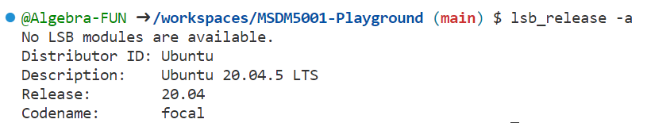
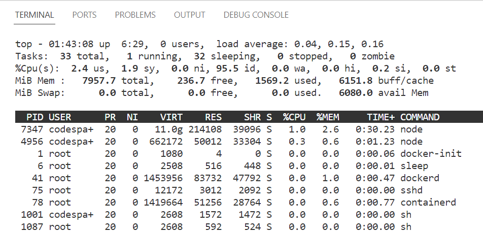
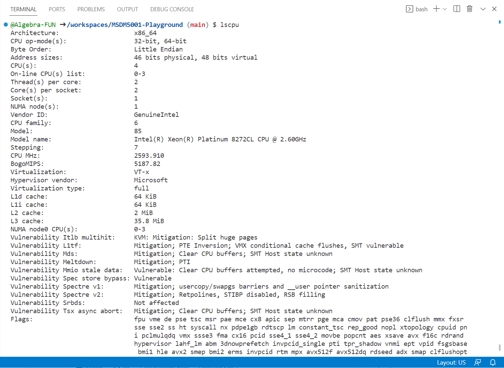
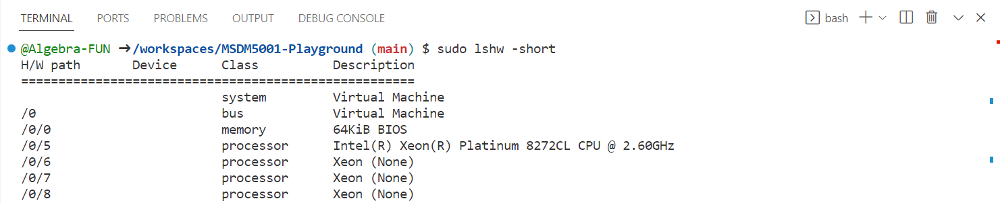
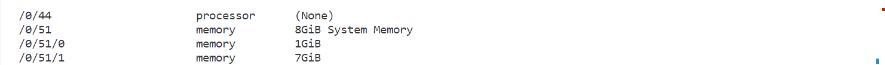
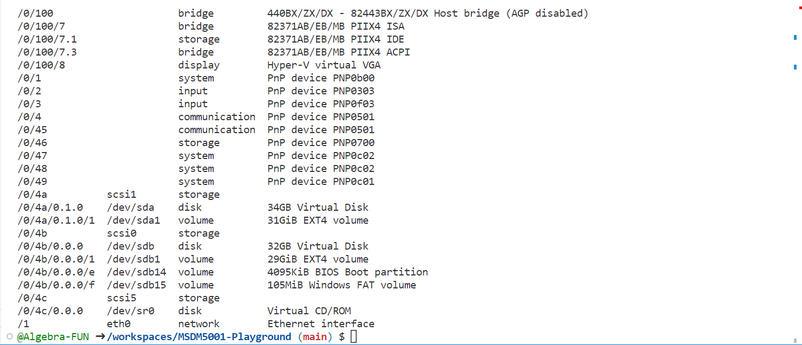
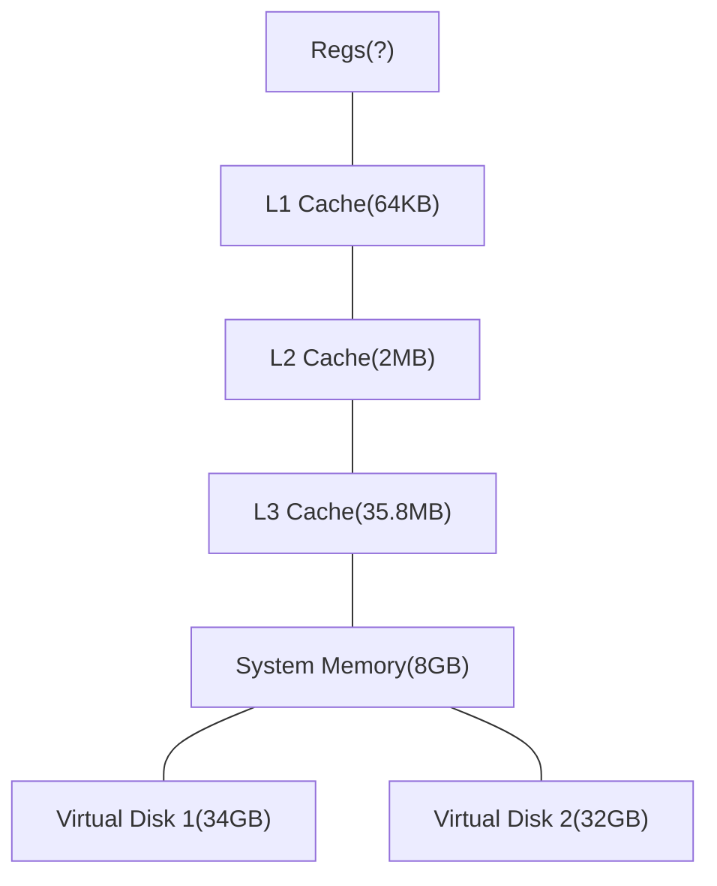
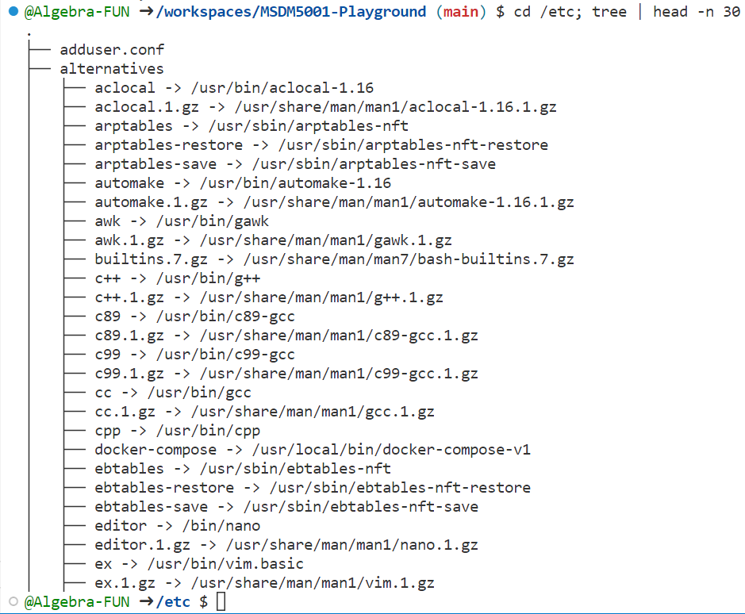

# Homework 1

### Version Table

|        | Version                                 |
| ------ | --------------------------------------- |
| OS     | Ubuntu 20.04.5 LTS                      |
| Bash   | 5.0.17(1)-release (x86_64-pc-linux-gnu) |
| Python | 3.10.7                                  |

## Operating system and memory hierarchy

I use `Githud Codespace` to finish this homework.  `Githud Codespace` is a remote development environment with Linux OS. Since you taught something about Git and GitHub, I think you can try `Github Codespace` either.

> Unfortunately, it turns out that you should be github pro user to get access to codespace:sweat_smile:

First of all, I will show the version info of this Linux environment with running this command:

```shell
lsb_release -a
```

then, the result:



### Open a terminal, run the command ”top”, and save a screenshot in your report.



### Use a few Linux commands to collect the hardware information of your computer to draw the memory hierarchy diagram (see Lecture 1). List the used commands and briefly explain what they are used for.

Run command:

```shell
lscpu
```

to get info of cpu, then the output:



Run command:

```shell
sudo lshw --short
```

to get info about hardware, then the output:





#### memory hierarchy diagram



Instead of drawing a pyramid, I draw in this way. The first reason is that there are two virtual disk playing role as secondary storage. The other reason is that I draw this flowchart with mermaid in a markdown editor while mermaid doesn't have syntax for pyramid figure.

#### List the used commands and briefly explain what they are used for.

```shell
lscpu
sudo lshw --short
```

The first command `lscpu` are used for viewing info of cpu.

The second command `lshw` are used for viewing info of all hardware. However, you should add prefix `sudo` to run it as super-user, otherwise output may be incomplete.

### Install the Linux “tree” command if your Linux system does not have. Run the commands. Paste the output into your report and briefly explain what these commands did.

Run this comm ands:

```shell
cd /etc; tree | head -n 30
```
then, get output:



Explain of this command:

1. `cd /etc` means change directory to "/etc"
2. `tree | head -n 30` where `|` is pipe operator and ` head -n 30` means only print first 30 lines, so the whole command means list directory under "/etc" in tree structure and only print first 30 lines.

## Bash script

> Write a bash script to create 180 directories/folders, whose names are “MSDM1, MSDM2, MSDM3, ..., MSDM180”. 
> In each directory, generate a text file, “time till now.txt”, in which the content is **microseconds** since 
> 1970-01-01 00:00:00 UTC:
> < XXXXXXXXXXXXXXXX >
> The digits in <> should be calculated when you execute the script. 

Run this command:

```shell
bash bash-task.sh MSDM 180
```

Then you will see 180 directories are created under "MSDMs" folder with "time till now.txt" in each directory.


## Regular expression

> Write bash or python scripts to get the desired data from the “block-list.xml” file. You should simply print the whole lines.

### Extract lines with specific blockID

> Print all the text lines with the “blockID” values that **start with the letter “i” or “d”**, and **end with digits**, e.g., ‘<emItem blockID="i334"  id="{0F827075-B026-42F3-885D-98981EE7B1AE}">’. (Tip: In the xml file, “blockID” is the attribute name and “i334” is the attribute value.)

The python scripts for this task named as `regex-task1.py`. Run this command:

```shell
python regex-task1.py
```

### Extract lines with specific email addresses

> Print all the text lines where the “id” values are email addresses ending with “.com” or “.org”. Skip the email addresses that are written by regular expressions containing special characters, such as “\, /, ˆ ”.

The python scripts for this task named as `regex-task2.py`. Run this command:

```shell
python regex-task2.py
```

## GitHub webpage

> Create a webpage on GitHub.com using the “index.html” file. Share the domain name in your report.

I deploy the “index.html” file at [https://algebra-fun.github.io/DDM-Coursework/MSDM5001/Assignment/HW1/](https://algebra-fun.github.io/DDM-Coursework/MSDM5001/Assignment/HW1/). You can visit it by click above url.

Furthermore, I hope you can visit my github home page [https://github.com/Algebra-FUN](https://github.com/Algebra-FUN) either and follow me even give me some stars.  It will help me a lot :smirk:.