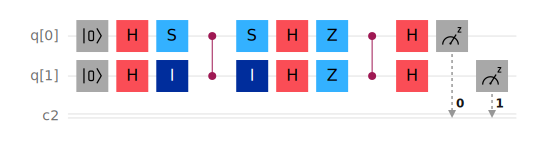

# Grover Search Algorithm on IBM QE

Consider 2 qubits. In the four basis states 00, 01, 10 and 11, assume 01 is the hidden item to search for.

## Experiments on IBM Quantum

### Repeat 1 time

#### Quantum circuit

#### Result

