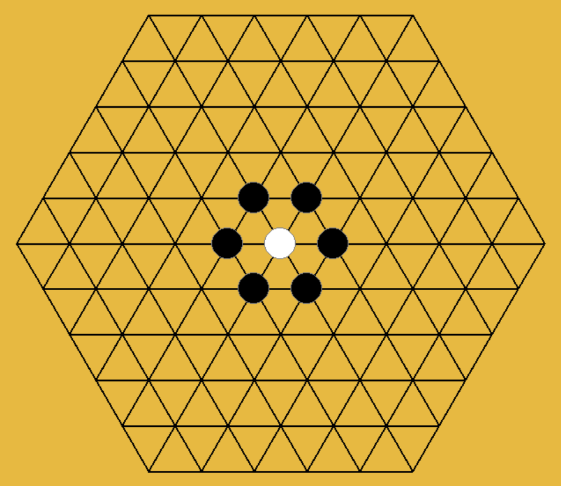
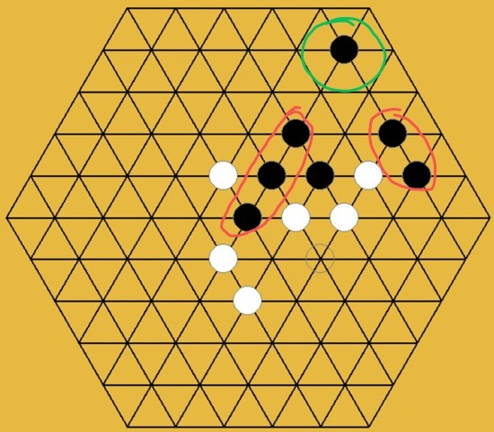
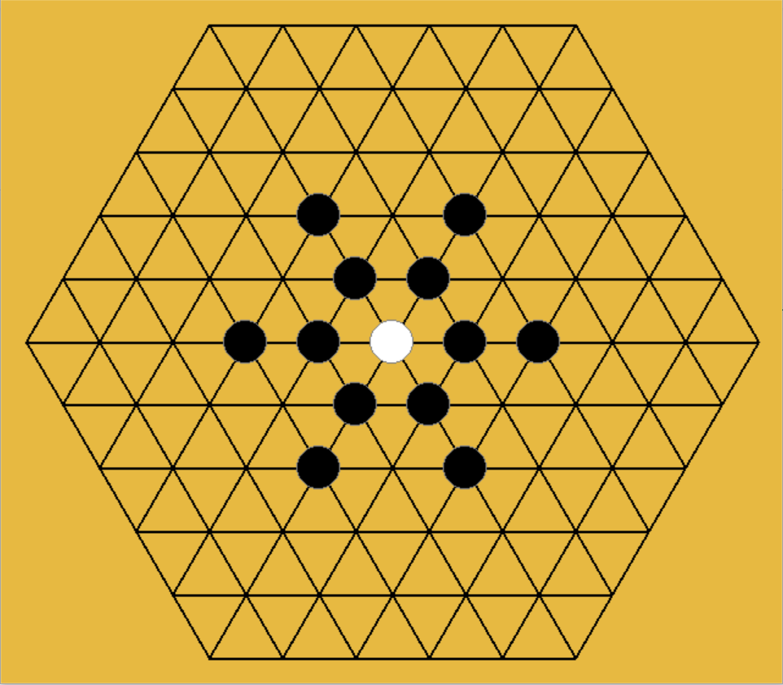
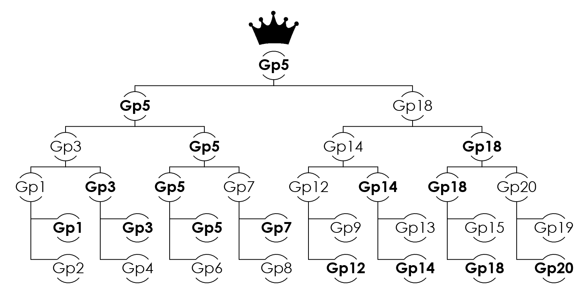

# Report of Project: HexWuzi-MCTS

<center>FAN Yifei</center>
## Understanding of MCTS

*(In this section, I won't talk about the basis of MCTS, assuming the readers have basic knowledge about MCTS)*

Well, in a nutshell, the Monte Carlo Tree Search algorithm is a Monte Carlo version of the game-tree search algorithm. So if we have enough computational resources and time, we can just traverse all the possible states in the search space and get the real winning probability distribution for each valid action based on a given state by simulations. However, we can't do that since it's impractical and the time is limited, the Monte Carlo method is applied to deal with this problem. Instead of getting the real winning probability distribution for each valid action, we just need to get an approximate estimation of the winning probability distribution by using the Monte Carlo method with a relatively small amount of simulations in a given limited time. Based on this understanding, how accurate the estimation of winning probability distribution can really decide whether the AI can take the right action to occupy a more favorable position and be able to win at the end of the game. 

So how can we make the estimation of winning probability distribution to be more accurate? In the Pure Monte Carlo game search algorithm, the algorithm just selects the node with the highest estimated winning probability to exploit, but how can we assert the node with the highest estimated winning probability has the highest real winning probability in just a small amount of simulation? It's just that the node with the highest estimated winning probability has a higher probability to have the highest real winning probability. The other nodes with relatively lower estimated winning probability have a high bias on the estimation of winning probability and still have the probability to be the node with the highest real winning probability since they don't get enough times of simulation. Thus, how to balance the exploitation of deep variants after taking action with the highest estimated winning probability and the exploration of actions with few simulations and lower estimated winning probability. `UCT`[2] is one way to deal with this balance problem and we use it in our approach. Although this method can help the algorithm to prevent missing the node with the highest estimated winning probability, it still takes great cost since it disperses the pitifully small amount of simulations on other unimportant nodes. 

So how can we save the number of simulations on other unimportant nodes and keep them on valuable nodes? There are many methods to solve this problem. One way is to add some artificial strategies to avoid the search algorithm carrying out simulations on mean-less action. For example, when the opponent has a "two-sided-alive-3-connect", the AI must have to block it otherwise game-over. In this situation, the search algorithm doesn't have to search for all actions to find the truth "block or die", you just tell AI to block it and let the search algorithm search what actions AI is going to take after blocking. However, the algorithm to detect these "block or die" situations is quite complex and it isn't easy to write code that can run with high performance. Another way is just to carry out as many as possible amounts of simulations in a limited time. Both of them rely on the performance of the algorithm and code.

Thus, the performance of the MCTS program is one of the key points to winning. Actually, the high performance of our program really helps us to win. Meanwhile, we also tried other ways to improve the ability of MCTS-AI, but the improvement of the ability of MCTS-AI is not significant since they hinder the performance of the program.

## Contribution 

### The basic backbone of MCTS

#### Architecture with OOP standard

I applied `OOP` standard in order to let the code organized and let teammates can extend the program easily.

#### Proposal  of "adjacency-only" search policy

I also proposed `adjacency-only` search policy, which means that only search the valid position adjacent to the existed stones in order to reduce size of search space. In this way, our code can have an at least acceptable performance to play with human rookie*(Actually we couldn't win our first version of MCTS-AI only because we were rookie and we also have improved our skill to beat the AI of our first version later)*. 



<center><strong>Fig.2.1</strong> The "adjacency-only" search policy. Where the white stone represents a existed stone here and black stone represents the positions we are going to search based on a given existed stone on the board.</center>
Although our program had already beaten opponent in a friendly match with one group, my teammates also realized that this search policy has big weakness. The situation when`adjacency-only` search policy fails is shown in **Fig2.2**.



<center><strong>Fig.2.2</strong> The situation when "adjacency-only" search policy fails. In this situation, human player took black and MCTS-AI took white. First human player tryied to place the those black stone in the red circle postions and formed a critical game point, since the black player could just place black stone in green circle position to win. But with "adjacency-only" search policy, our AI didn't search the green circle position which would lead to miss block on this critical position.</center>
HU Xinyu proposed and wrote the code of `snow-adjacent` search policy. Although, it isn't my contribution, but I still needs to briefly introduce what is the `snow-adjacent` search policy here by a figure:



<center><strong>Fig.2.3</strong> The "snow-adjacent" search policy. Where the white stone represents a existed stone here and black stone represents the positions we are going to search based on a given existed stone on the board. Since it looks like a snowflake, then calls it `snow-adjacent`.</center>
Just with `adjacency-only` search policy, our program doesn't have chance to win any strong opponent. And this creative `snow-adjacent` solves the weakness of `adjacency-only` search policy, preventing the situation in **Fig2.2** happen and giving us chance to win.

#### Utilization of existed search tree

Instead of building a new search tree every time after opponent take action, I tried to utilize the existed search result(existed node in the search tree) in order to let the search algorithm search deeper to get a more accurate estimation of winning probability distributions of each action based on the current state and let MCTS-AI have a far-sight which can improve our probability to win opponent's AI.

### Optimization

#### Optimize with Numba

Before coding, we had realized the importance of performance, so I tried to use `Numba` to accelerate the program in the developing progress. For example, we applied `@njit` on frequently called function like `check` , `rollout` and `reward`. Meanwhile, I applied `@jitclass` on frequently used class `HexWuZiState`. Actually the `numba.jitclass` is hard to use, I had tried to apply it on `TreeNode` class, but it turned out that the recursive structure would create a huge difficulty on type system of `Numba`.  

#### Optimize board check function

The first version of `check` function was written by my friend WANG Tianyi. The "template.py" had misled him to write the first version of `check` function in form of `check(board)`, which obeyed the requirement but inefficient. Because he treated the `board` as statical objects without considering the information from action(which stone is the new one). 

Suppose the side length of the represent matrix is $N$, and we have to check $M$-connect(in this game $M=5$), so the time complexity of `check(board)`function is $O(MN^2)$. If we can use the information of action, we can just check around the new stone, then the time complexity of `check(board,action=None)`function is $O(M)$.  

Actually, we still can reduce the time complexity of `check` function to $O(1)$ by utilizing the former check result, but we didn't have time to implement it.

#### Optimize expand function

In original MCTS with `UCT`, we have to explore all valid and possible child nodes at least one time and `UCT` will lead algorithm to balance exploitation and exploration. However, if one child wins, then we just have to keep the winning child and don't have to explore other children. But the `UCT` will force expand function to still explore other children if we keep them, which will waste some simulations.

Thus, we optimize expand function in this way as the following code shown:

```python
class TreeNode:
    def __init__(self, state: HexWuZiState, parent: TreeNode, action):
        pass
    def expand(self):
        action = self.untried_actions.pop()
        child = TreeNode(self.state.take_action(action), self, action)
        if child.terminal:
            # when child is terminal, then which means the current player wins or draw
            # just keep current terminal child and remove other children
            self.children = {action: child}
            # then stop explore other node by clear untrid actions
            self.untried_actions = None
        else:
            self.children[action] = child
        return child
```

### Julia back-end version

First, let me quote well-known sayings to explain why I used other language to accelerate the program.

1. "Life is short, you need Python" -- Bruce Eckel

2. "It is unworthy of excellent men to lose hours like slaves in the labour of calculation which could safely be relegated to anyone else if machines were used." -- Gottfried Wilhelm Leibniz

The first well-known saying "Life is short, you need Python" is quite famous, people always use it to persuade rookies to learn Python, but it's not true for all situation, it's obviously wrong for this final project. My teammates and I really had wasted our young life on optimizing the Python code, hoping it can run faster. But performance of the python version still be bad and can't support the `snow-adjacent` search policy since the search space doubled, then this version of python implementation just behave like a dumb-ass. But does it prove that `snow-adjacent` search policy is noneffective? No, only the performance of python version isn't good enough to support this new search policy.

The second well-known saying from Leibniz can be transformed in this way to explain my thought

"It is unworthy of excellent young people to waste their life on optimizing Python code which could easily be translated to any other good computer languages and runs much faster." 

So that's the reason why I wrote a Julia back-end to carry out this task. The Julia version is really faster than previous Python version with Numba.

<center><strong>Table.2.1</strong> Performance comparison of each version</center>
| Version           | Performance(times of simulation in 5 seconds) |
| ----------------- | --------------------------------------------- |
| "Pure Python"     | 800-900                                       |
| Python with Numba | 8k-9k                                         |
| Pure Julia        | 35k-40k                                       |

You can see how fast Pure Julia can be, comparing to Python. The performance of Julia version is strong enough to support the `snow-adjacent` search policy. 


## Peer evaluation table

| Name        | Score (0-10) |
| ----------- | ------------ |
| HU Xinyu    | 10           |
| WANG Tianyi | 10           |
| XU Zixuan   | 10           |

Thank for my teammates' hard work. 

## Achievement of our work

<center><strong>We are the champion</strong></center>



<center><strong>Fig.4.1</strong> The final result of final competition. We are Group5.</center>

## Our Code

After final competition, we made the repository open on the Github, you can view  the source code by click following links:

[Python version](https://github.com/HexWuZi-Research/HexWuZi-MCTS): https://github.com/HexWuZi-Research/HexWuZi-MCTS

[Julia version](https://github.com/HexWuZi-Research/HexMCTS.jl): https://github.com/HexWuZi-Research/HexMCTS.jl

## Reference

[1] Rémi Coulom (2007). "Efficient Selectivity and Backup Operators in Monte-Carlo Tree Search". Computers and Games, 5th International Conference, CG 2006, Turin, Italy, May 29–31, 2006. Revised Papers. H. Jaap van den Herik, Paolo Ciancarini, H. H. L. M. Donkers (eds.). Springer. pp. 72–83. CiteSeerX 10.1.1.81.6817. ISBN 978-3-540-75537-1.

[2] Kocsis, Levente; Szepesvári, Csaba (2006). "Bandit based Monte-Carlo Planning". In Fürnkranz, Johannes; Scheffer, Tobias; Spiliopoulou, Myra (eds.). Machine Learning: ECML 2006, 17th European Conference on Machine Learning, Berlin, Germany, September 18–22, 2006, Proceedings. Lecture Notes in Computer Science. Vol. 4212. Springer. pp. 282–293. CiteSeerX 10.1.1.102.1296. doi:10.1007/11871842_29. ISBN 3-540-45375-X.