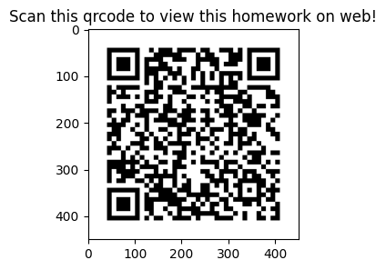

# Assignment 2

FAN, Yifei (20912792)

> If you want to see the details(code, plots and outputs) of this assignments, you can visit it by scanning this qrcode.

## 1. Consider the conventional 30-year mortgage rate of U.S.

from June 1976 to March 2007.

The data are obtained from Federal Reserve Bank at St Louis.

1. Take the natural log transformation of the mortgage rate to build a time series model for the series.
   
   In this question, I carried out a grid search to find the best fitted model with the best AIC. The final selected model is `ARIMA(3,1,0)`.
   
   The summary is:
   
   | Dep. Variable: | log_rate         | No. Observations: | 370       |
   | -------------- | ---------------- | ----------------- | --------- |
   | Model:         | ARIMA(3, 1, 0)   | Log Likelihood    | 820.726   |
   | Date:          | Sat, 25 Mar 2023 | AIC               | -1633.453 |
   | Time:          | 12:09:51         | BIC               | -1617.810 |
   | Sample:        | 06-01-1976       | HQIC              | -1627.239 |
   
   |        | coef    | std err  | z      | P>\|z\| | [0.025 | 0.975] |
   | ------ | ------- | -------- | ------ | ------- | ------ | ------ |
   | ar.L1  | 0.5323  | 0.049    | 10.758 | 0.000   | 0.435  | 0.629  |
   | ar.L2  | -0.3491 | 0.041    | -8.560 | 0.000   | -0.429 | -0.269 |
   | ar.L3  | 0.0894  | 0.054    | 1.654  | 0.098   | -0.017 | 0.195  |
   | sigma2 | 0.0007  | 3.12e-05 | 21.949 | 0.000   | 0.001  | 0.001  |
   
   | Ljung-Box (L1) (Q):     | 0.00 | Jarque-Bera (JB): | 281.52 |
   | ----------------------- | ---- | ----------------- | ------ |
   | Prob(Q):                | 0.96 | Prob(JB):         | 0.00   |
   | Heteroskedasticity (H): | 0.92 | Skew:             | 0.67   |
   | Prob(H) (two-sided):    | 0.64 | Kurtosis:         | 7.07   |

2. Perform model checking using Q(12) for residuals. (all tests are based on the 5% significance level)
   
   |     | lb_stat | lb_pvalue |
   | --- | ------- | --------- |
   | 12  | 0.05655 | 1.0       |
   
   The p-value for the Ljung-Box test is about $1.000$, which is greater than $\alpha=0.05$,so we failed to reject the null hypothesis that the residuals are uncorrelated.

3. Write down the fitted model.
   
   The formula for the fitted model is:

$$
(1-0.5323B+0.3491B^2-0.08938B^3)(1-B)r_t=-0.0007143+a_t,
\\\hat{\sigma_a^2}=0.0007
$$

4. Use the fitted model to produce 1-step to 4-step ahead forecasts at the forecast origin March, 2007.  
   
   | date    | forecast |
   | ------- | -------- |
   | 2007-04 | 1.804210 |
   | 2007-05 | 1.805119 |
   | 2007-06 | 1.808577 |
   | 2007-07 | 1.808861 |

## 2.Recall the monthly simple returns of the Decile 1 portfolio from January 1980 to December 2006.

1. Use seasonal model to analyze the Deceile 1 returns. The model is a multiplicative seasonal model as ARIMA(0,0,1)(1,0,1) with period 12.
   
   The fitted model's summary:
   
   |                |                              |                   |          |
   | -------------- | ---------------------------- | ----------------- | -------- |
   | Dep. Variable: | return                       | No. Observations: | 324      |
   | Model:         | ARIMA(0, 0, 1)x(1, 0, 1, 12) | Log Likelihood    | 420.447  |
   | Date:          | Sat, 25 Mar 2023             | AIC               | -830.894 |
   | Time:          | 12:09:51                     | BIC               | -811.990 |
   | Sample:        | 0                            | HQIC              | -823.348 |
   
   |          | coef    | std err | z      | P>\|z\| | [0.025 | 0.975] |
   | -------- | ------- | ------- | ------ | ------- | ------ | ------ |
   | const    | 0.0183  | 0.014   | 1.313  | 0.189   | -0.009 | 0.046  |
   | ma.L1    | 0.2438  | 0.035   | 7.011  | 0.000   | 0.176  | 0.312  |
   | ar.S.L12 | 0.9998  | 0.014   | 74.032 | 0.000   | 0.973  | 1.026  |
   | ma.S.L12 | -0.9888 | 0.363   | -2.724 | 0.006   | -1.700 | -0.277 |
   | sigma2   | 0.0041  | 0.001   | 3.147  | 0.002   | 0.002  | 0.007  |
   
   |                         |      |                   |         |
   | ----------------------- | ---- | ----------------- | ------- |
   | Ljung-Box (L1) (Q):     | 0.02 | Jarque-Bera (JB): | 1105.75 |
   | Prob(Q):                | 0.89 | Prob(JB):         | 0.00    |
   | Heteroskedasticity (H): | 1.93 | Skew:             | 0.72    |
   | Prob(H) (two-sided):    | 0.00 | Kurtosis:         | 11.94   |

2. Perform model checking on the fitted model, e.g., compute Q(24) of the residuals. Is the model adequate? (all tests are based on the 5% significance level)
   
   |     | lb_stat   | lb_pvalue |
   | --- | --------- | --------- |
   | 24  | 23.332411 | 0.326514  |
   
   The p-value for the Ljung-Box test is 0.3265, which is greater than α=0.05, so we fail to reject the null hypothesis that the residuals are uncorrelated. Then this test result indicates that the model is adequate.

3. Write down the fitted model.

$$
(1-0.9998B^{12})r_t=3.7154\times10^{-6}+(1-0.2438B)(1+0.9888B^{12})a_t,\\\hat{\sigma_a}^2=0.0041
$$

# 3. Consider the quarterly earnings per share of the Alcoa stock

from the 4th quarter of 1991 to the most recent quarter. Note that some earnings are negative.

1. Build a model for the earning series.
   
   In this question, we carried out a grid search to find the best hyperparameter for the best model with the best AIC. 
   
   The final selected best model is `Seasonal ARIMA(1, 0, 0)x(1, 0, 0, 4)`
   
   The summary of this model:
   
   |                |                             |                   |         |
   | -------------- | --------------------------- | ----------------- | ------- |
   | Dep. Variable: | earning                     | No. Observations: | 61      |
   | Model:         | ARIMA(1, 0, 0)x(1, 0, 0, 4) | Log Likelihood    | 51.819  |
   | Date:          | Sat, 25 Mar 2023            | AIC               | -95.639 |
   | Time:          | 12:12:04                    | BIC               | -87.195 |
   | Sample:        | 0                           | HQIC              | -92.329 |
   
   |         | coef   | std err | z     | P>\|z\| | [0.025 | 0.975] |
   | ------- | ------ | ------- | ----- | ------- | ------ | ------ |
   | const   | 0.3204 | 0.143   | 2.246 | 0.025   | 0.041  | 0.600  |
   | ar.L1   | 0.7206 | 0.095   | 7.595 | 0.000   | 0.535  | 0.907  |
   | ar.S.L4 | 0.6993 | 0.082   | 8.533 | 0.000   | 0.539  | 0.860  |
   | sigma2  | 0.0101 | 0.001   | 8.513 | 0.000   | 0.008  | 0.012  |
   
   |                         |      |                   |       |
   | ----------------------- | ---- | ----------------- | ----- |
   | Ljung-Box (L1) (Q):     | 0.41 | Jarque-Bera (JB): | 54.12 |
   | Prob(Q):                | 0.52 | Prob(JB):         | 0.00  |
   | Heteroskedasticity (H): | 1.65 | Skew:             | -0.42 |
   | Prob(H) (two-sided):    | 0.27 | Kurtosis:         | 7.54  |

2. Perform model checking to ensure that the model is adequate using Q(12) of the residuals.
   
   |     | lb_stat       | lb_pvalue |
   | --- | ------------- | --------- |
   | 12  | 23.334.903769 | 0.897513  |
   
   The p-value for the Ljung-Box test is 0.8975, which is greater than α=0.05, so we fail to reject the null hypothesis that the residuals are uncorrelated. Then this test result indicates that the model is adequate.

3. Use the model to produce 1-step to 4-step ahead forecasts. (all tests are based on the 5% significance level)
   
   | step | forecast |
   | ---- | -------- |
   | 1    | 0.552168 |
   | 2    | 0.737951 |
   | 3    | 0.835315 |
   | 4    | 0.608900 |
